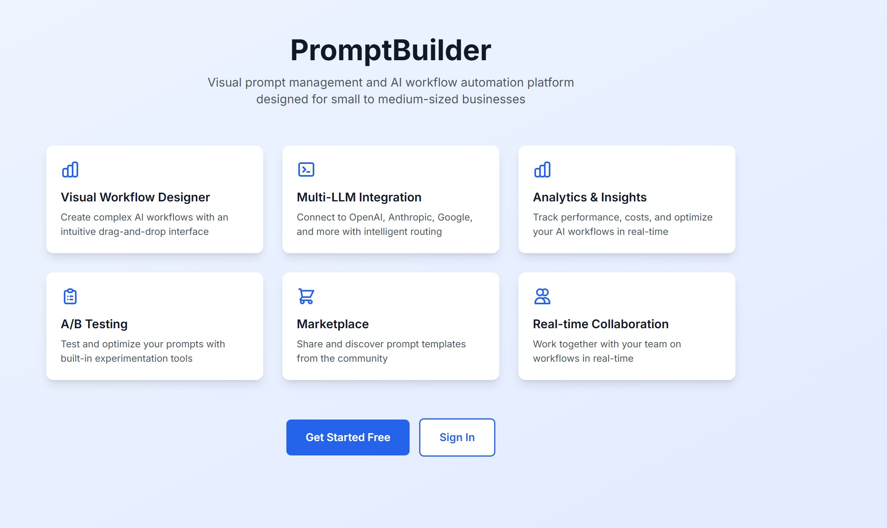
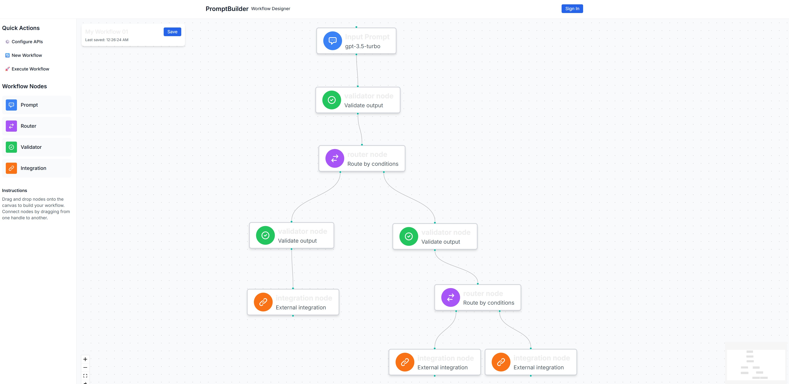

<div align="center">

# PromptBuilder

### Visual Prompt Operations Platform for Modern Teams

**Build, orchestrate, and optimize AI workflows without writing code**



[](https://nextjs.org/)
[](https://www.typescriptlang.org/)
[](LICENSE)
[](CONTRIBUTING.md)

[Features](#-features) • [Quick Start](#-quick-start) • [Demo](#-demo) • [Documentation](#-documentation) • [Contributing](#-contributing)

</div>

---

## 🎯 Overview

PromptBuilder is a comprehensive **Prompt Operations Platform** designed to democratize AI workflow automation for small and medium-sized businesses. Create sophisticated multi-LLM workflows using an intuitive visual interface—no coding required.

### The Problem We Solve

Most businesses want to leverage AI but face significant barriers:
- **Technical Complexity**: Building AI workflows requires extensive programming knowledge
- **Cost Opacity**: No clear visibility into AI spending and ROI
- **Integration Challenges**: Connecting multiple AI providers is difficult
- **Collaboration Gaps**: Teams can't easily share and optimize prompts together

### Our Solution

PromptBuilder provides an enterprise-grade platform that makes AI accessible:
- **Visual Workflow Designer**: Drag-and-drop interface powered by React Flow
- **Multi-LLM Support**: Seamlessly integrate OpenAI, Anthropic, Google, and more
- **Cost Intelligence**: Real-time tracking and optimization of AI spending
- **Team Collaboration**: Real-time co-editing and workflow sharing
- **Template Marketplace**: Discover and share proven workflows

---

## ✨ Features

### Core Capabilities

| Feature | Status | Description |
|---------|--------|-------------|
| **Visual Designer** | ✅ Active | Intuitive drag-and-drop workflow creation with React Flow |
| **Multi-LLM Routing** | 🚧 In Progress | Intelligent routing across OpenAI, Anthropic, Google Gemini |
| **Real-time Collaboration** | 🚧 In Progress | Yjs-powered concurrent editing with presence indicators |
| **Analytics Dashboard** | 📋 Planned | Comprehensive usage, cost, and performance metrics |
| **Template Marketplace** | 📋 Planned | Community-driven workflow sharing and monetization |
| **A/B Testing** | 📋 Planned | Built-in prompt experimentation and optimization |

### Technical Highlights

- **Type-Safe API**: Full-stack type safety with tRPC
- **Real-time Database**: Supabase with PostgreSQL and Row-Level Security
- **Workflow Automation**: n8n integration for complex orchestration
- **Modern Stack**: Next.js 14, React 18, TypeScript, Tailwind CSS
- **Enterprise Security**: SSO support, encryption at rest, audit logging

---

## 🚀 Quick Start

### Prerequisites

- **Node.js** 18+ ([Download](https://nodejs.org/))
- **Docker** ([Download](https://www.docker.com/products/docker-desktop/))
- **Git** ([Download](https://git-scm.com/))

### Installation

```bash
# Clone the repository
git clone https://github.com/Agentic-Person/PromptBuilder.git
cd PromptBuilder

# Install dependencies
npm install

# Configure environment variables
cp .env.example .env.local
# Edit .env.local with your credentials

# Start the development server
npm run dev

# Open your browser
open http://localhost:3000
```

### Environment Setup

Create a `.env.local` file with the following variables:

```bash
# Supabase Configuration
NEXT_PUBLIC_SUPABASE_URL=your_supabase_url
NEXT_PUBLIC_SUPABASE_ANON_KEY=your_supabase_anon_key
SUPABASE_SERVICE_KEY=your_service_key

# n8n Configuration
N8N_BASE_URL=http://localhost:5678
N8N_API_KEY=your_n8n_api_key

# LLM Provider API Keys
OPENAI_API_KEY=sk-...
ANTHROPIC_API_KEY=sk-ant-...
```

See [`.env.example`](.env.example) for complete configuration options.

---

## 🎨 Demo

### PromptBuilder Application



### Visual Workflow Designer

Create complex AI workflows with an intuitive drag-and-drop interface:


### Analytics Dashboard

Track performance, costs, and usage across your organization:


---

## 🏗️ Architecture

```
┌─────────────────────────────────────────────────────────────┐
│                     Frontend (Next.js 14)                    │
│  ┌──────────────┐  ┌──────────────┐  ┌──────────────┐      │
│  │   Designer   │  │  Analytics   │  │ Marketplace  │      │
│  │ (React Flow) │  │  Dashboard   │  │   Browser    │      │
│  └──────────────┘  └──────────────┘  └──────────────┘      │
└─────────────────────────────────────────────────────────────┘
                            │
                    ┌───────┴───────┐
                    │  tRPC API     │
                    └───────┬───────┘
                            │
        ┌───────────────────┼───────────────────┐
        │                   │                   │
   ┌────▼─────┐      ┌─────▼──────┐     ┌─────▼──────┐
   │ Supabase │      │    n8n     │     │  LLM APIs  │
   │   (DB)   │      │ Workflows  │     │  Routing   │
   └──────────┘      └────────────┘     └────────────┘
```

### Technology Stack

**Frontend**
- Next.js 14 (App Router)
- React 18 with TypeScript
- React Flow for visual workflows
- Tailwind CSS for styling
- Zustand for state management

**Backend**
- tRPC for type-safe APIs
- Supabase (PostgreSQL + Auth)
- n8n for workflow automation
- Yjs for real-time collaboration

**Infrastructure**
- Vercel (Hosting)
- Docker (n8n containerization)
- GitHub Actions (CI/CD)

---

## 📁 Project Structure

```
PromptBuilder/
├── src/
│   ├── app/                    # Next.js 14 app directory
│   │   ├── designer/          # Workflow designer page
│   │   ├── workflow/          # Workflow management
│   │   └── api/               # API routes
│   ├── components/            # React components
│   │   ├── workflow/          # Workflow designer components
│   │   ├── analytics/         # Analytics dashboards
│   │   └── ui/                # Reusable UI components
│   ├── server/                # Backend logic
│   │   ├── api/               # tRPC routers
│   │   ├── db/                # Database schemas
│   │   └── services/          # Business logic
│   ├── lib/                   # Shared utilities
│   └── types/                 # TypeScript definitions
├── supabase/                  # Database migrations & policies
├── n8n/                       # n8n workflow templates
├── docs/                      # Documentation & assets
└── tests/                     # Test suites
```

---

## 🛠️ Development

### Available Scripts

```bash
# Development
npm run dev              # Start dev server
npm run build            # Build for production
npm run start            # Run production build
npm run typecheck        # Run TypeScript checks

# Code Quality
npm run lint             # Lint codebase
npm run lint:fix         # Auto-fix linting issues
npm run format           # Format with Prettier

# Database
npm run db:migrate       # Run Supabase migrations
npm run db:seed          # Seed database
npm run db:types         # Generate TypeScript types

# Testing (Coming Soon)
npm test                 # Run tests
npm run test:watch       # Watch mode
npm run test:coverage    # Coverage report
```

### Contributing

We welcome contributions! Please see our [Contributing Guide](CONTRIBUTING.md) for details.

1. Fork the repository
2. Create your feature branch (`git checkout -b feature/amazing-feature`)
3. Commit your changes (`git commit -m 'feat: add amazing feature'`)
4. Push to the branch (`git push origin feature/amazing-feature`)
5. Open a Pull Request

---

## 📊 Development Status

**Current Version**: 0.1.0 (Alpha)

| Component | Completion | Notes |
|-----------|-----------|-------|
| Visual Designer | 85% | Core functionality complete |
| Database Schema | 100% | All tables and policies defined |
| tRPC API | 70% | Main routers implemented |
| Authentication | 60% | Supabase Auth integrated |
| n8n Integration | 50% | Service layer written, testing needed |
| Analytics | 30% | Dashboard in development |
| Marketplace | 10% | Design phase |
| Mobile Support | 0% | Planned for v0.3.0 |

---

## 🗺️ Roadmap

### Q4 2024 - Alpha Release (v0.1.0)
- [x] Core workflow designer
- [x] Database architecture
- [ ] User authentication
- [ ] Workflow execution engine
- [ ] Basic analytics

### Q1 2025 - Beta Release (v0.2.0)
- [ ] Real-time collaboration
- [ ] Cost tracking & optimization
- [ ] Template library
- [ ] Team management
- [ ] API access

### Q2 2025 - Public Release (v1.0.0)
- [ ] Marketplace launch
- [ ] Advanced analytics
- [ ] Mobile apps
- [ ] Enterprise features
- [ ] Multi-language support

---

## 📖 Documentation

- **[Getting Started Guide](docs/getting-started.md)** - Step-by-step tutorial
- **[Architecture Overview](docs/architecture.md)** - System design and patterns
- **[API Reference](docs/api-reference.md)** - tRPC endpoint documentation
- **[Deployment Guide](docs/deployment.md)** - Production deployment instructions
- **[Contributing Guidelines](CONTRIBUTING.md)** - How to contribute

---

## 🔒 Security

PromptBuilder takes security seriously:

- **Encryption at Rest**: All sensitive data encrypted in the database
- **Row-Level Security**: Supabase RLS policies enforce data isolation
- **API Key Management**: Secure credential storage with encryption
- **Audit Logging**: Comprehensive tracking of all system actions
- **SSO Support**: Enterprise authentication via Supabase Auth

Found a security issue? Please email security@promptbuilder.io (DO NOT open a public issue)

---

## 📄 License

This project is licensed under the MIT License - see the [LICENSE](LICENSE) file for details.

---

## 🙏 Acknowledgments

Built with amazing open-source technologies:

- [Next.js](https://nextjs.org/) - React framework
- [React Flow](https://reactflow.dev/) - Workflow visualization
- [Supabase](https://supabase.com/) - Backend infrastructure
- [n8n](https://n8n.io/) - Workflow automation
- [tRPC](https://trpc.io/) - Type-safe APIs
- [Tailwind CSS](https://tailwindcss.com/) - Styling

---

## 📞 Contact & Support

- **GitHub Issues**: [Report bugs or request features](https://github.com/Agentic-Person/PromptBuilder/issues)
- **Discussions**: [Join the conversation](https://github.com/Agentic-Person/PromptBuilder/discussions)
- **Twitter**: [@PromptBuilder](https://twitter.com/promptbuilder)
- **Email**: support@promptbuilder.io

---

<div align="center">

**[⬆ back to top](#promptbuilder)**

Made with ❤️ by the PromptBuilder Team

</div>
